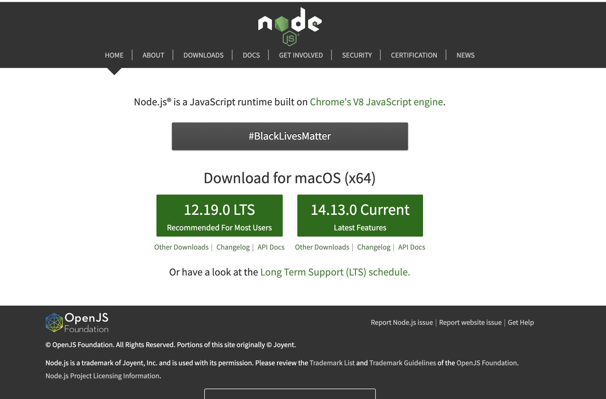
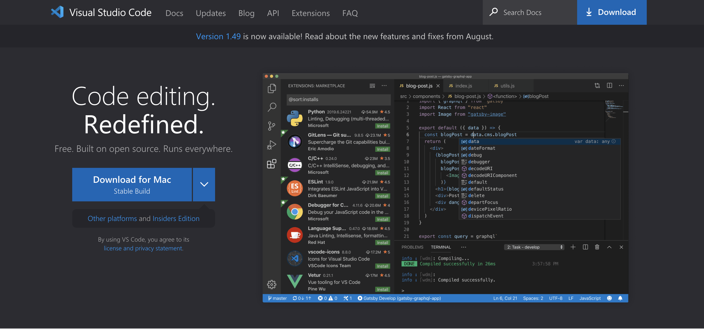
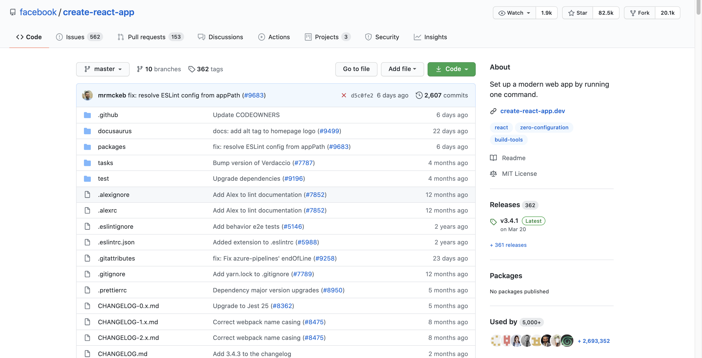
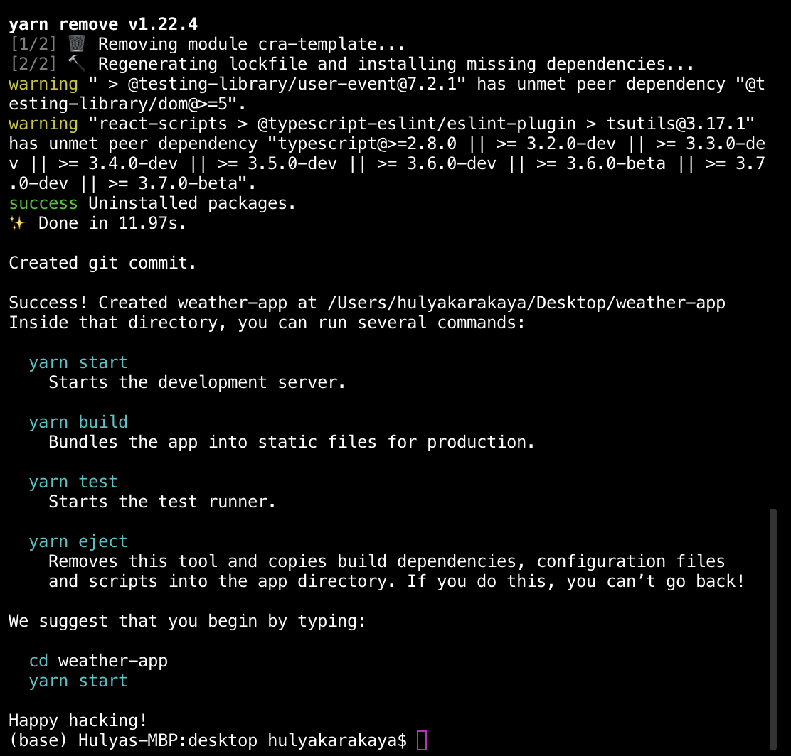
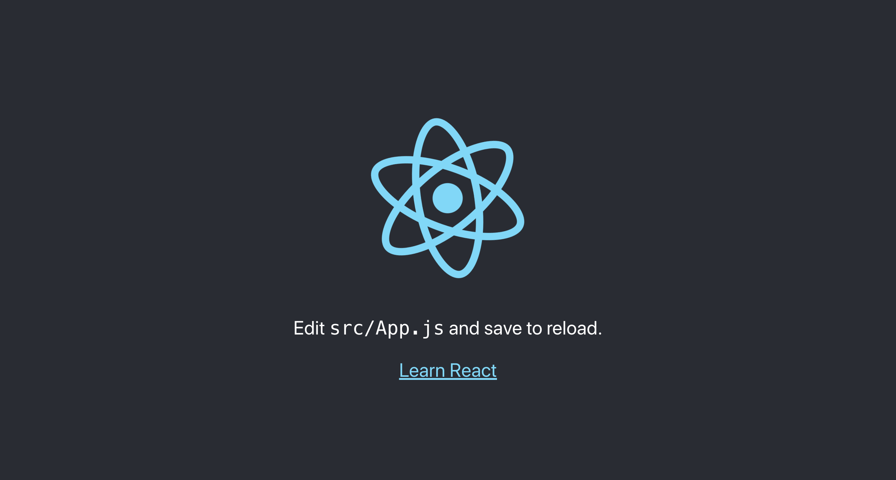
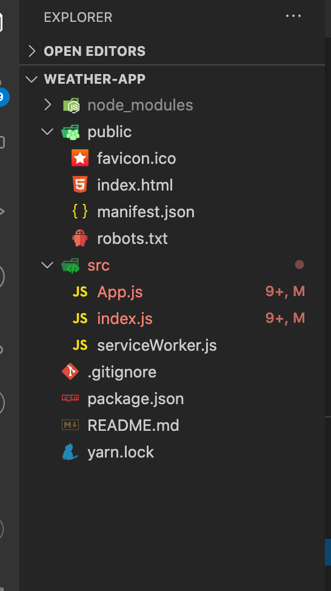

In this tutorial, we will create a React Weather App, and use the React's latest hooks. At the end of this tutorial, you will have the knowledge about React's most common hooks and how to create a custom hook.
You can check out the application that we will create in this tutorial.

#### Prerequisites

- Comfortable with Html
- Javascript, ES6 to see what is React and what is Javascript
- Basic React knowledge like props, components, one way-data-flow

### What we will cover

- Using state and useState
- fetching an API with useEffect
- use of custom hooks in our application

**By the end of the tutorial, you will have the following skill sets:**

The hands-on practical and real-life scenario of creating Weather Application using React Hooks

## What Are React Hooks?

Hooks are a new addition in React 16.8. With the help of hooks, we can use state and other React features without writing a class.

Before Hooks, we would need to understand how **this** keyword works in Javascript, and to remember to bind event handlers in class components.
There wasn't a particular way to reuse stateful component logic and this made the code harder to follow.

We needed to share stateful logic in a better way. React is designed to render components, and it doesn't know anything about routing, fetching data, or architecture of our project. So, React Hooks came to rescue.

Hooks are just functions that are exported from the official React page. They allow us to manipulate components in a different manner.

Hooks allow for attaching reusable logic to an existing component and use state and lifecycle methods inside a React functional component.
We can organize the logic inside a component into reusable isolated units. Hooks give developers the opportunity to separate **presentation logic**, the logic that is associated with how components appear on a page, from **business logic**, the logic that is associated with handling, manipulating, and storing business objects.

There are some **rules** about how to use hooks. The following rules are:

- only call hooks at the top level of the component
- don't call hooks inside loops, conditionals, or nested functions
- only call hooks from React functions
- call them from within React functional components and not just any regular Javascript function

Okay, now let's start working with our application.

### Application Tools

- [x] Install [NodeJS](https://nodejs.org/en/) and make sure it is the LTS(long term support) version. LTS version is a less stable version of NodeJS. We will use NPM (node package manager) and we will use it to install **create-react-app**.
      
- [x] Install your preferred code editor or IDE. I will be using Visual Studio Code. You can download it from [this website](https://code.visualstudio.com/). It is free to use.
      
- [x] **create-react-app** is an npm package that we can bootstrap our React application without any configuration.
      

Let's install our project. Open up your terminal and `cd` into the directory you want to create the project.

```bash
cd desktop
# type this command to install create-react-app, you can give any name for the app.
npx create-react-app weather-app
```

Now, let's wait for the project to be created, now all the packages are installed for us to use it.



Let's go inside our project folder, type the name of our project, and `cd` into it.

```bash
cd weather-app
# open the project files with Visual Studio or any code editor

#start the app
npm start
```



Now we can see our app is up and running. Before starting our app, let's make some cleanup and remove some of the files that we will not use.

Let's remove `App.test.js, index.css, logo.svg, setupTests.js` from the `src` folder. You can copy and paste the basic structure for App.js and index.js from the code snippets below.

```javascript
// App.js

import React from 'react';
import './App.css';

function App() {
  return <div className="App"></div>;
}

export default App;
```

```javascript
// index.js

import React from 'react';
import ReactDOM from 'react-dom';
import App from './App';
import * as serviceWorker from './serviceWorker';

ReactDOM.render(<App />, document.getElementById('root'));

// If you want your app to work offline and load faster, you can change
// unregister() to register() below. Note this comes with some pitfalls.
// Learn more about service workers: https://bit.ly/CRA-PWA
serviceWorker.unregister();
```

Also, we can remove `logo` files from the `public` folder, now my files are looking like this:


