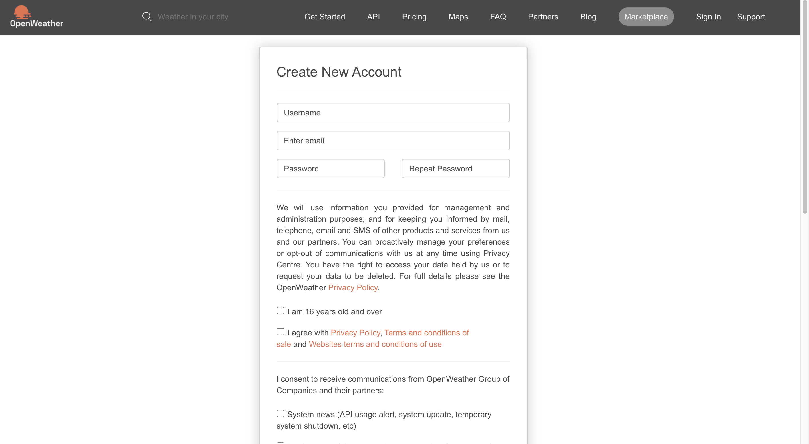
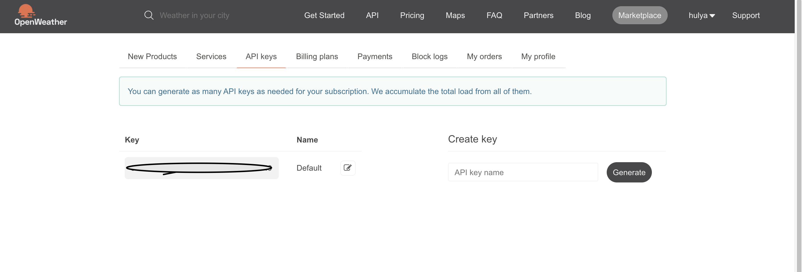
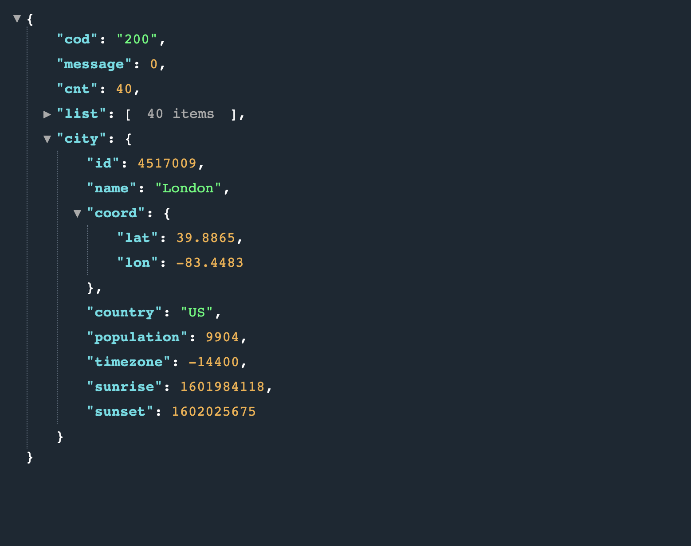

### Getting Our Api Key

Let's go to [open weather map](https://openweathermap.org/api) to get our API key to fetch real weather data.

Choose [5 Day / 3 Hour Forecast](https://openweathermap.org/forecast5) from the page. With this api, we can get access to next 5 day's weather for a specified city.
But before we use the open weather map, we need to have an **API key**. For that [create an account](https://home.openweathermap.org/users/sign_up) and go to API keys tab to see your API key.





Let's check the example from the page and open a new tab and paste the this url.

```bash
# replace API key with your API key
api.openweathermap.org/data/2.5/forecast?q=London,us&appid={API key}
```

Now, we can see the json data.



Default data comes with _imperial_ system, we can change it to _metric_ system by specifying another query parameter. If you are comfortable using imperial system, you don't need to change the query.

```bash
api.openweathermap.org/data/2.5/forecast?q=London,us&appid={API key}&units=metric
```

Now, let's see what we get from our data.

- first create an api key and create config file and export
- import react-bootstrap and css to public files
  `npm install react-bootstrap bootstrap`
  `https://react-bootstrap.github.io/getting-started/introduction`
- bootstrap components => cards => component Weather Card
- rafce => shortcut from visual studio code => ES7 code extension
- weather api dt means datetime in unix timestamp format, main weather => rain, icon
- pass the props and pass them inside the component
- `{dt, temp_min, temp_max, main, icon}`
- dt javascript uses milliseconds => unit seconds in the api , multiply by 1000
- for the icon go to website and go to LIST OF WEATHER CONDITIONS PAGE `https://openweathermap.org/weather-conditions`
- EVERY icon has a different code number
- example url :`http://openweathermap.org/img/wn/10d@2x.png`
- then to make it dynamic link change 10d and pass as icon prop

- show datetime => receive the date in milliseconds
- create a date object
- date class constructor
- show the date in p tag, month starts with 0, add +1

- create a new component City Selector
- pass a function which will invoke when a button is clicked
- it will contain one state property => city
- import useState
- select the city which the user types
- clicks button, we fetch the weather forecast for that city
- bootstrap layout
- define rows and columns
- when user clicks the button, invoke onSelectButtonClick function
- pass the current city
- IMPORT cityselector to App.js
- destructure the prop
- make the styling
- give <Col xs={8} /> it will take 2 third of the total length

- console log the city which the user typed, and clicked the check weather button
- fetch the weather from the current city
- useFetch hook

- add useFetch and useState
- create a custom hook
- and pass it to App.js

- create another component cards populate the data with 5 cards
- &cnt=5 count 5

- create getContent function to return for every conditions
- pass the conditions
- call inside the app component
- to make a new search, clear the previous search'

```javascript
// clear the search and data
setInProgress(true);
setData(null);
setError(null);
```

```javascript
// if invalid city, show error
    if (data.cod >= 400) {
         setError(data.message);
         return;

```

This is a link to [another document.](doc3.md) This is a link to an [external page.](http://www.example.com/)
