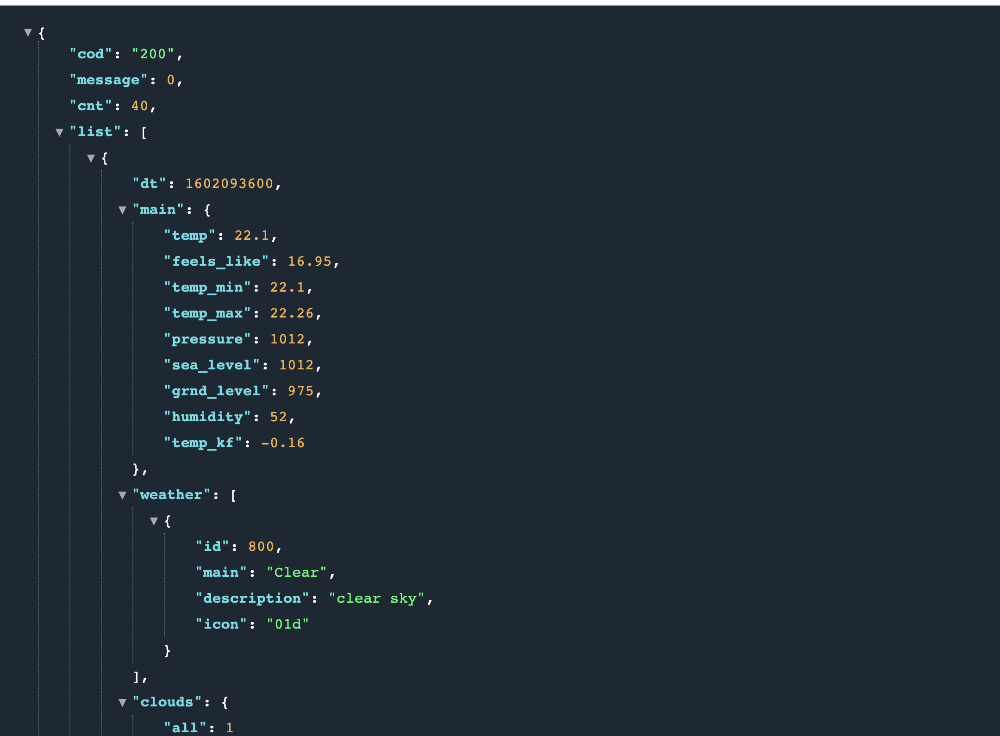

## Getting Our Api Key

Let's go to `[open weather map](https://openweathermap.org/api)` to get our API key to fetch real weather data.

Choose [5 Day / 3 Hour Forecast](https://openweathermap.org/forecast5) from the page. With this API, we can get access to the next 5-day weather data for a specified city.
But before we use the open weather map, we need to have an **API key**. For that [create an account](https://home.openweathermap.org/users/sign_up) and go to the API keys tab to see your API key.


Let's check the example from the page and open a new tab and paste this URL.

```bash
# replace API key with your API key
api.openweathermap.org/data/2.5/forecast?q=London,us&appid={API key}
```

Now, we can see the JSON data.


Default data comes with the _imperial_ system, we can change it to the _metric_ system by specifying another query parameter. If you are comfortable using the imperial system, you don't need to change the query.

```bash
api.openweathermap.org/data/2.5/forecast?q=London,us&appid={API key}&units=metric
```



Now, let's see what we get from our data. We will be using the icon for the weather, let's see what the code means. From the documentation, we can find [this page](https://openweathermap.org/weather-conditions) and see what the icon codes mean. We will use this URL `http://openweathermap.org/img/wn/10d@2x.png` for our image source.

We will fetch the minimum and maximum temperature of the next five days, along with icons.

Now, let's create a new folder named `apis` directory under the `src` directory and create a new file named `config.js` for our API key, and add this file to your `.gitignore` file to not to expose our API key. Also, let's put our `baseUrl` here. We will come back here later to add our fetching logic.

```javascript
// apis/config.js
export const API_KEY = [YOUR_API_KEY];
const API_BASE_URL = 'http://api.openweathermap.org/';
```

## Styling The App

_We will be using React Bootstrap for styling the app. You can check out [the documentation](https://react-bootstrap.github.io/getting-started/introduction)._

Let's install the react-bootstrap to our project

```javascript
npm install react-bootstrap bootstrap
```

Now, we need to include CSS to our project inside `src > index.js`.

```javascript
// index.js
import 'bootstrap/dist/css/bootstrap.min.css';
```
