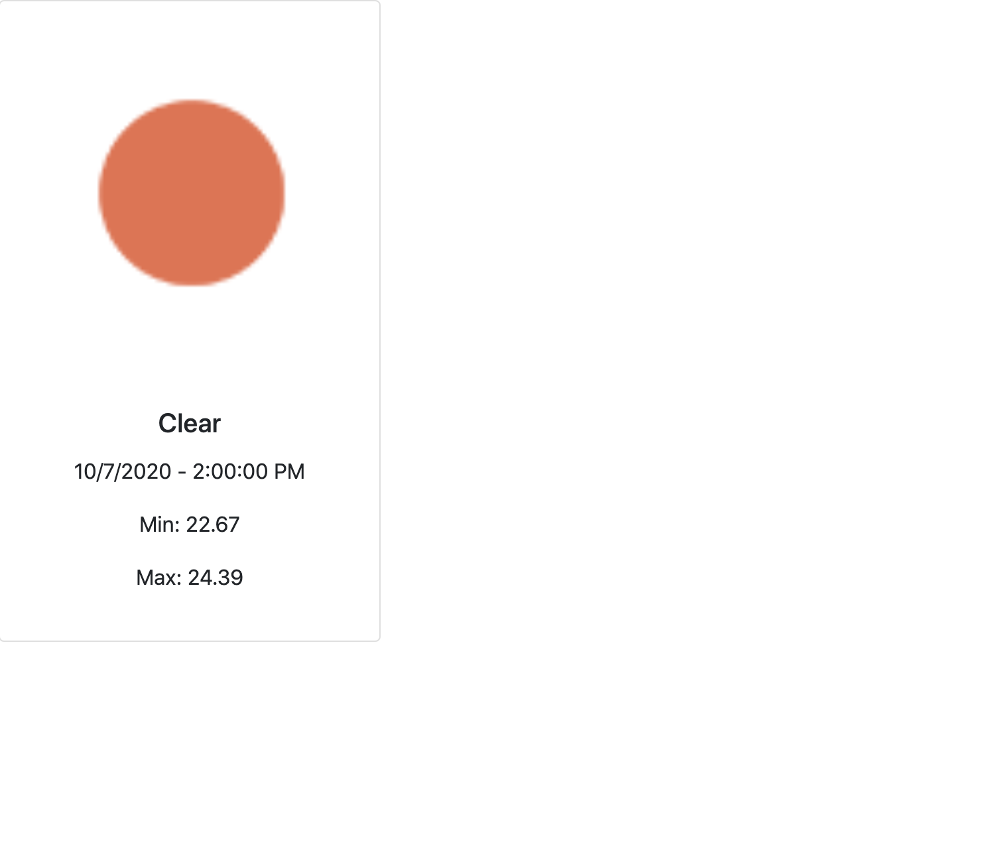

Let's start by creating our first component and show our API data to the user.

Inside the `src` folder, let's create another folder named `components`. Now, create our first component and name it `WeatherCard.js`
This component will be a functional component and it will receive some props and we will display them. We will use the `Bootstrap Card component` to add some styling.
Now, we can copy [Card component](https://react-bootstrap.github.io/components/cards/) from bootstrap to our component. We don't need `Card.Text` and `Button`, we will remove those.

```javascript
import React from 'react';
import {Card} from 'react-bootstrap';

const WeatherCard = (props) => {
  return (
    <Card style={{width: '18rem'}}>
      <Card.Img variant="top" src="holder.js/100px180" />
      <Card.Body>
        <Card.Title>Card Title</Card.Title>
      </Card.Body>
    </Card>
  );
};

export default WeatherCard;
```

We want to show the `minimum` and `maximum temperatures` for a date, but `dt` datetime is in Unix timestamp. Also, we will display the `main` weather.
Now, let's extract our props and display them inside the jsx. Props have the same name as the JSON data that we get from API.

For the icon, we can get a list of [weather conditions](https://openweathermap.org/weather-conditions). Every icon has a different code number.

- example url :`http://openweathermap.org/img/wn/10d@2x.png`

We will replace `10d` with the `icon` prop to make it dynamic.

```javascript
// WeatherCard.js

import React from 'react';
import {Card} from 'react-bootstrap';

const WeatherCard = ({dt, temp_min, temp_max, main, icon}) => {
  // create a date object with Date class constructor
  const date = new Date(dt);
  return (
    <Card style={{width: '18rem'}}>
      <Card.Img
        variant="top"
        // get the src from example url and pass the icon prop for icon code
        src={`http://openweathermap.org/img/wn/${icon}@2x.png`}
      />
      <Card.Body>
        <Card.Title>{main}</Card.Title>
        {/*  datetime is received in milliseconds, let's turn into local date time */}
        <p>
          {date.toLocaleDateString()} - {date.toLocaleTimeString()}
        </p>
        {/* minimum temperature */}
        <p>Min: {temp_min}</p>
        {/* maximum temperature */}
        <p>Max: {temp_max}</p>
      </Card.Body>
    </Card>
  );
};

export default WeatherCard;
```

Now, let's import the `WeatherCard` component into `App.js`. And pass our props, we will pass hardcoded values for now.

```javascript
// App.js

import React from 'react';
import WeatherCard from './components/WeatherCard';
import './App.css

const App = () => {
  return (
    <div className="App">
      {/* dt uses milliseconds but javascript uses milliseconds, multiply with 1000 */}
      <WeatherCard
        dt={1602104400 * 1000}
        temp_min="22.67"
        temp_max="24.39"
        main="Clear"
        icon="01d"
      />
    </div>
  );
};

export default App;
```

Now, let's start our app with `npm start` from terminal. We can see our weather data is displayed. We will use this component to show the next 5 days.



This is a link to [another document.](doc3.md)
