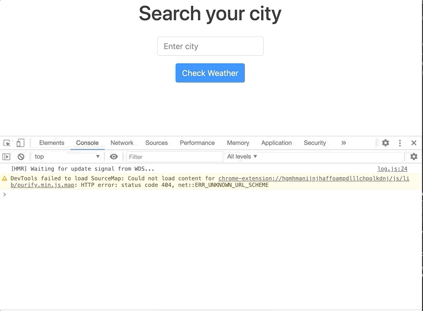
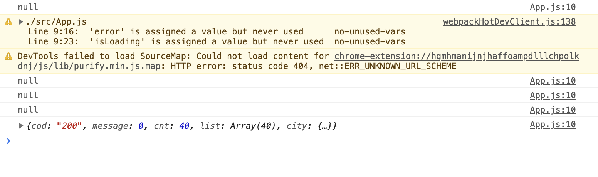

## Displaying Api Results


Now, time to display our API data inside our application.

Let's go back to our `CitySelector` component and call our API.

First, let's create an anonymous function for our `onSearch` function.

To grab data from an external resource or to just retrieve data, we will use `fetch` browser API. Fetch takes our `url` call. We need to get our `baseUrl` and our `Api key` from our `config.js` file. Let's import it to our file.

`import {API_KEY, baseUrl} from '../apis/config';`

Fetch returns a promise and we need to await it, we will put `.then`, after that our response will be in `json` format, we need to extract the body of response, and finally we will get our `result`.

Now `onSearch` function should look like this:

```javascript
const onSearch = () => {
  fetch(`${baseUrl}/data/2.5/forecast?q=${city}&appid=${API_KEY}&units=metric`)
    .then((response) => response.json())
    .then((result) => console.log(result));
};
```



Also, we can show our data when the user presses `Enter` key. Let;s implement that with JavaScript.
Add `onKeyDown` to `FormControl (input)`, it will receive a callback function with the event inside.

```javascript
const onKeyDown = (event) => {
  if (event.keyCode === 13) {
    onSearch();
  }
};

<Row>
  <Col xs={4} className="text-center">
    <FormControl
      placeholder="Enter city"
      onChange={(event) => setCity(event.target.value)}
      value={city}
      // add onKeyDown
      onKeyDown={onKeyDown}
    />
  </Col>
</Row>;
```

To display our data, we need to create another state for our `results.`

`const [results, setResults] = useState(null);`

```javascript
const CitySelector = () => {
  const [city, setCity] = useState('');
  const [results, setResults] = useState(null);

  const onSearch = () => {
    fetch(
      `${baseUrl}/data/2.5/forecast?q=${city}&appid=${API_KEY}&units=metric`
    )
      .then((response) => response.json())
      // update the results
      .then((result) => setResults(result));
  };

  const onKeyDown = (event) => {
    if (event.keyCode === 13) {
      onSearch();
    }
  };

  return (
    <>
      <Row>
        <Col>
          <h1>Search your city</h1>
        </Col>
      </Row>

      <Row>
        <Col xs={4} className="text-center">
          <FormControl
            placeholder="Enter city"
            onChange={(event) => setCity(event.target.value)}
            value={city}
            onKeyDown={onKeyDown}
          />
        </Col>
      </Row>

      <Row>
        <Col>
          <Button onClick={onSearch}>Check Weather</Button>
        </Col>
      </Row>

      {renderResults}
    </>
  );
};
```

## Custom Hooks for Search

Create a new folder under `src`, then create a new file named `useFetch.js`

```javascript
import {useState, useEffect} from 'react';

const useFetch = (url) => {
  const [data, setData] = useState(null);
  const [error, setError] = useState(null);
  const [isLoading, setIsLoading] = useState(null);

  useEffect(() => {
    setIsLoading(true);
    fetch(url)
      .then((response) => response.json())
      .then((data) => {
        setIsLoading(false);
        setData(data);
      })
      .catch((error) => {
        setIsLoading(false);
        setError(error);
      });
  });

  return {data, error, isLoading};
};

export default useFetch;
```

Now, let's import this into our `App.js` component, and pass our custom hook.

`import UseFetch from '../hooks/useFetch';`

We need to call the Api, every time the button is clicked.

```javascript
import React from 'react';
import CitySelector from './components/CitySelector';
import './App.css';
import {Container} from 'react-bootstrap';

import {API_KEY, baseUrl} from './apis/config';
import UseFetch from './hooks/useFetch';

const App = () => {
  const {data, error, isLoading, setUrl} = UseFetch();
  // print the results
  console.log(data);

  return (
    <Container className="App">
      <CitySelector
        onSelectButtonClick={(city) =>
          setUrl(`${baseUrl}/data/2.5/forecast?q=${city}&appid=${API_KEY}`)
        }
      />
    </Container>
  );
};

export default App;
```

It prints multiple times, because we have different setters inside our custom hook.



## Populate the Data

Now, populate the data abd show 5 day's weather data. Create another component. Under components folder, create `WeatherList.js` component